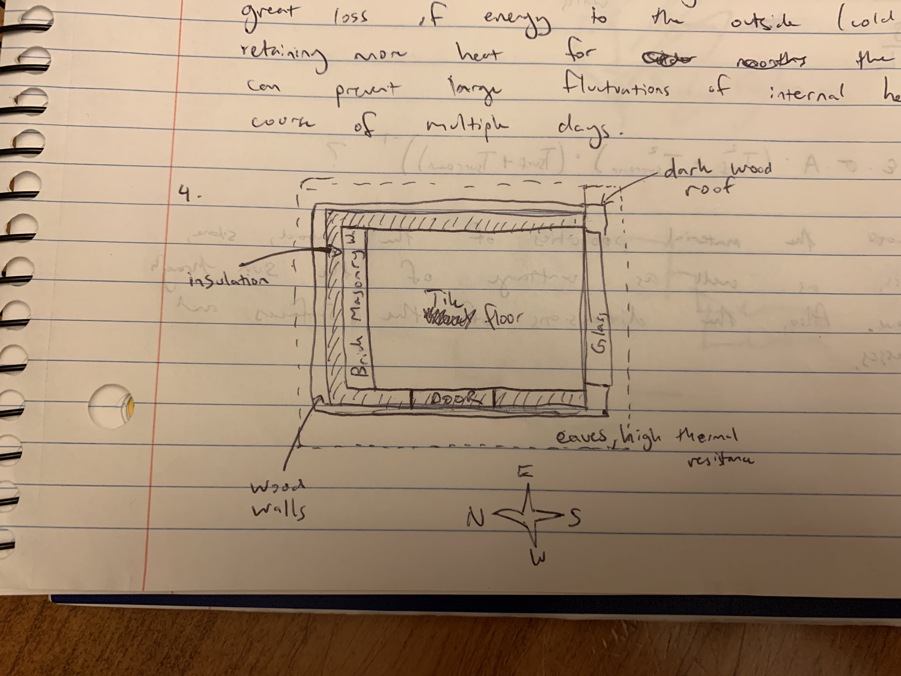
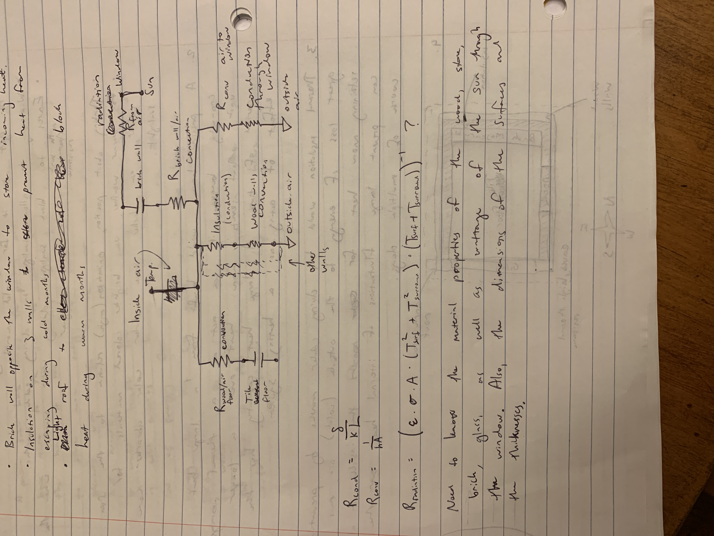

# Assignment 8

## 8.1

1.  
   * Some element with a large heat capacity to store energy for cold months
   * Windows to allow sunlight in during cold months
   * Eaves with high thermal resistance to block sunlight during warm months when the sun is higher
   * Thinking about position and orientation (angle) relative to the sun
   * For warmer weather, use brighter colored materials, for colder climates, use darker colors that absorb more sunlight
2. A passive house would benefit from a large heat capacity because it can act as a thermal storage unit that emits more heat over a longer period of time. A large heat capacity is like a large battery or capacitor that can store charge
3. Thermal insulation would help during clder months by preventing great loss of energy to the outside (cold) air, thus retaining more heat for the inside. It can also prevent large fluctuations of internal heat over the course of multiple days
4. 
5.  
   * Glass windowed wall for low resistance/high heat transfer
   * Brick wall opposite the window to store incoming heat
   * Insulation on 3 walls to prevent heat from escaping during cold months

## 8.2 and 8.3

**https://tinyurl.com/y2m2qv6f** <-- Google Doc

## 8.4

